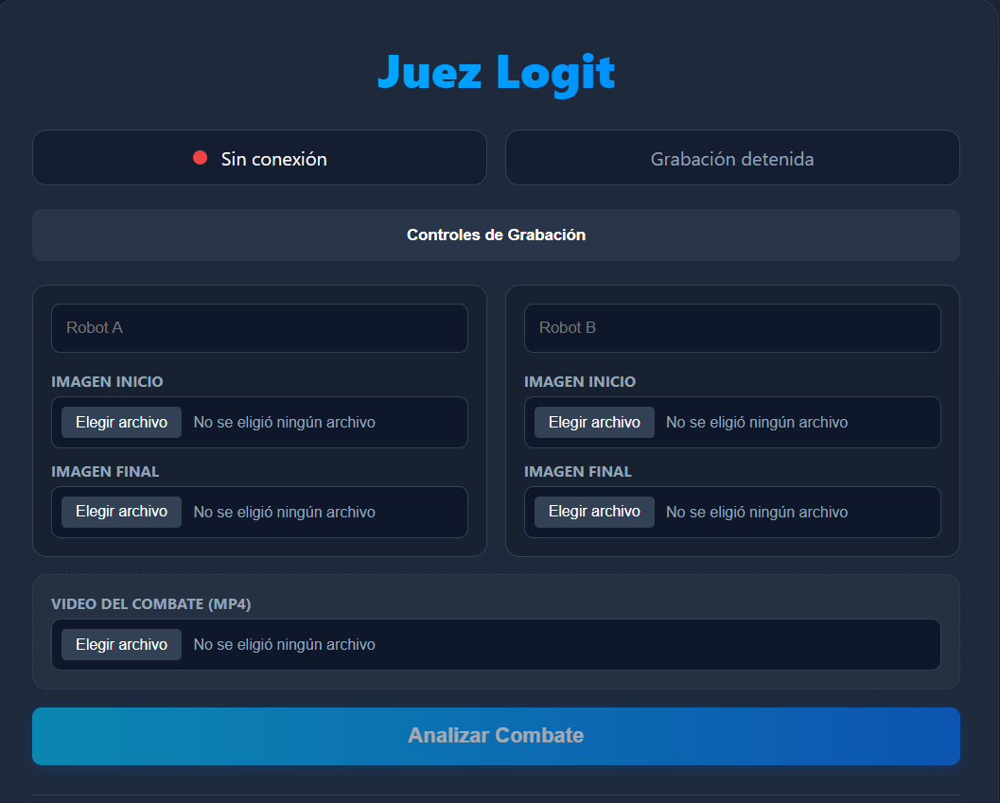
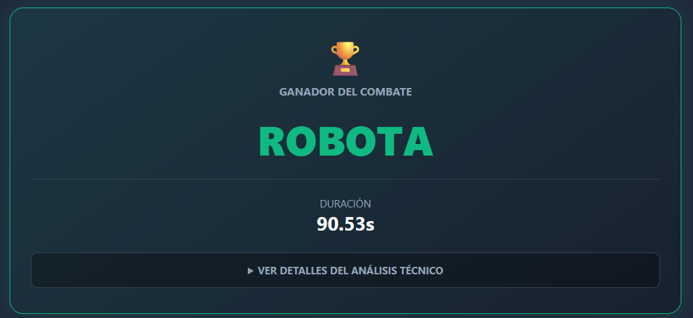
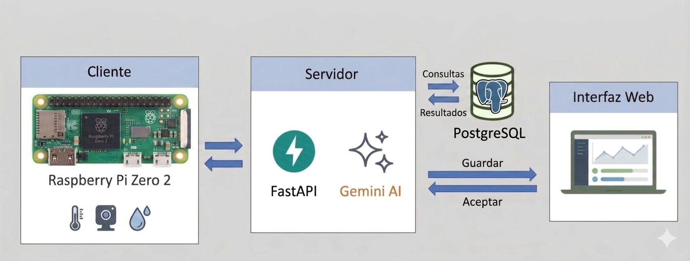

# Juez Logit  
### Sistema Inteligente de Arbitraje para Combates de Robótica

[]()  
[](https://fastapi.tiangolo.com/)  
[]()  
[]()

---

## Descripción

**Juez Logit** es un sistema inteligente de arbitraje automatizado diseñado para evaluar combates de robótica de forma objetiva mediante análisis de video e imágenes.

El sistema utiliza un motor de IA para interpretar el combate, aplicar criterios técnicos y determinar un ganador basado en métricas cuantificables.

Está optimizado para ejecutarse en dispositivos de bajo consumo como la Raspberry Pi, permitiendo captura en tiempo real y procesamiento remoto.


---

## Capturas del Sistema

<p align="center">
  
  
</p>
<p align="center">
  <em>Interfaz principal</em> &nbsp;&nbsp;&nbsp; | &nbsp;&nbsp;&nbsp; <em>Resultados</em>
</p>
---

## Características

- Grabación en tiempo real desde Raspberry Pi  
- Control remoto de captura  
- Análisis automático con IA  
- Evaluación basada en criterios técnicos  
- Determinación de ganador automatizada  
- Interfaz web dinámica  
- Historial de combates persistente  
- Procesamiento de imágenes antes/después del combate  

---

## Arquitectura del sistema

<p align="center">
  
</p>
<p align="center"><em>Arquitectura del sistema</em></p>

---

## Stack Tecnológico

| Componente     | Tecnología                          |
|----------------|-------------------------------------|
| Backend        | FastAPI + Uvicorn                   |
| Frontend       | HTML5, CSS3, JavaScript             |
| Templates      | Jinja2                              |
| IA             | Gemini API                          |
| Cliente HTTP   | HTTPX                               |
| Configuración  | python-dotenv                       |
| Hardware       | Raspberry Pi Zero 2W + Cámara USB   |

---

## Instalación

```bash
git clone https://github.com/PatrickZ29/Nhrl.git
cd backend

# Instalar dependencias
pip install -r requirements.txt
```

---

## Ejecución

```bash
uvicorn main:app --reload
```

Abrir en navegador:

http://localhost:8000

---

## Flujo del Sistema

1. Se inicia la grabación desde la Raspberry Pi  
2. Se captura el video del combate  
3. Se envía al backend  
4. Se analiza con IA  
5. Se procesan resultados  
6. Se muestra el ganador en la interfaz  

---

## Motor de Evaluación

El sistema evalúa cada robot en base a:

| Criterio       | Puntaje máximo |
|----------------|----------------|
| Agresividad    | 0 – 15         |
| Condición      | 0 – 5          |
| Daño           | 0 – 10         |
| Control        | 0 – 10         |

El puntaje total determina el ganador.

---

## Ejemplo de Resultado

GANADOR: Robot A

| ROBOT A        | Puntaje máximo |
|----------------|----------------|
| Agresividad    | 12             |
| Condición      | 4              |
| Daño           | 8              |
| Control        | 7              |
| TOTAL          | 31             |

| ROBOT B        | Puntaje máximo |
|----------------|----------------|
| Agresividad    | 8              |
| Condición      | 2              |
| Daño           | 5              |
| Control        | 6              |
| TOTAL          | 31             |

---

## API Endpoints

| Endpoint           | Método | Descripción             |
|--------------------|--------|-------------------------|
| `/upload`          | POST   | Subir video             |
| `/analyze`         | POST   | Analizar combate        |
| `/historial`       | GET    | Ver historial           |
| `/start_recording` | GET    | Iniciar grabación       |
| `/stop_recording`  | GET    | Detener grabación       |
| `/recording_status`| GET    | Estado de grabación     |

---

## Estructura del Proyecto

```text
juez-logit/
│
├── backend/                # Lógica central del sistema
│   ├── models/             # Definiciones de datos y esquemas
│   ├── services/           # Lógica de negocio y procesamiento
│   ├── routers/            # Endpoints de la API
│   ├── templates/          # Vistas HTML (Flask/Jinja2)
│   ├── videos/             # Almacenamiento de archivos multimedia
│   ├── database.py         # Gestión de persistencia
│   └── main.py             # Punto de entrada del backend
├── rules_engine.py         # Algoritmo de decisión y lógica de arbitraje
├── server.js               # Servidor de interfaz / Integración Node.js
├── requirements.txt        # Dependencias de Python
└── README.md               # Documentación del proyecto
```


## Futuras mejoras

- [ ] Detección automática de eventos en combate  
- [ ] Dashboard con estadísticas    
- [ ] Sistema de ranking de robots  
- [ ] Streaming en tiempo real
